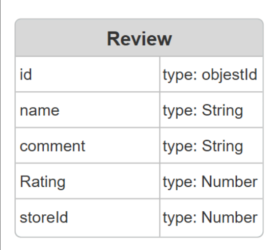
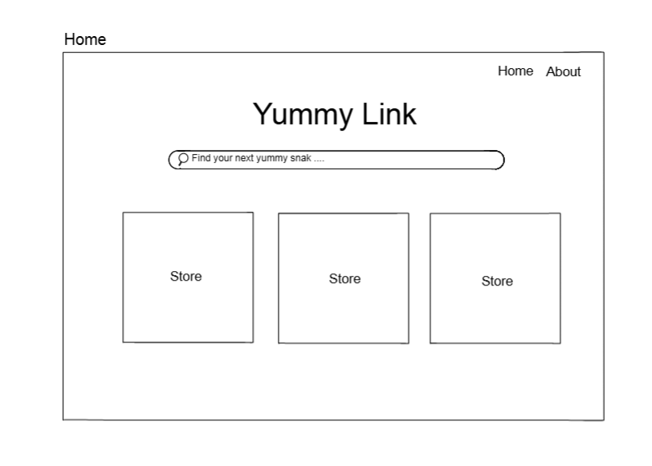
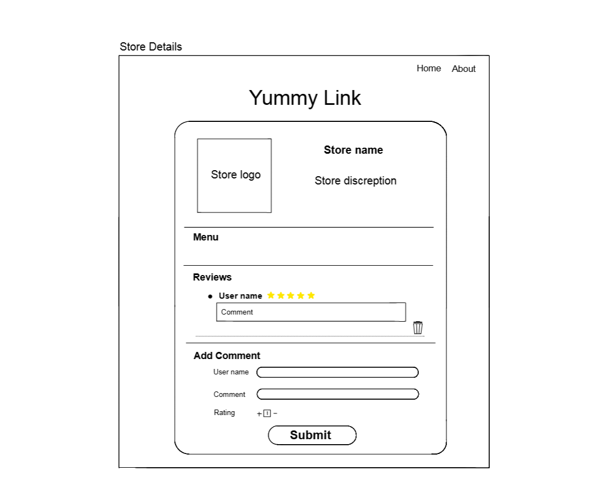
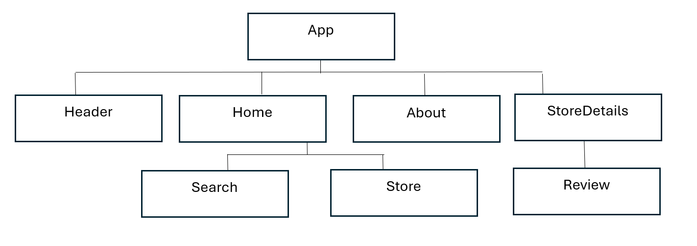

# 🧁Yummy-Link-Frontend🍭

**Date:** August/6/2025

**By:** [Noor Salman](https://github.com/NOORSALMAN25) | [Malak Jasim](https://github.com/Malak1805) | [Fatema Albasri](https://github.com/fatemaAlbasri) 

## **_Description🌟_**

YummyLink is a user-friendly web application that helps park visitors discover delicious snacks and treats around the amusement park. The frontend is built to provide an engaging and visually appealing experience, allowing users to search for specific items and view detailed Food stall cards—all within a colorful theme park environment.

[Yummy-Link-BackEnd](https://github.com/NOORSALMAN25/Yummy-Link-backend)

## **_Technologies Used💻_**

- Programmed using VS Code v1.101.2

  - React
  - Axios
  - Express
  - Node.js
  - CSS
  - JavaScript

## **_Entity Relationship Diagram (ERD)_**

## **_Wireframes_**

## **_The Components Hierarchy_**

## **_Credits_**
[LucidChart](https://www.lucidchart.com/pages?gad_campaignid=1484560207&gad_source=1&gbraid=0AAAAADLdSjAG8I3cXQPvTlM989xj1Soph&gclid=CjwKCAjw-svEBhB6EiwAEzSdrsIXlzoG1A821oSkKdzuRL4OjFrrS03AK31VI9URxxts63QNQV6w-hoC2pIQAvD_BwE&km_CPC_AdGroupID=60168114191&km_CPC_CampaignId=1484560207&km_CPC_Country=9218669&km_CPC_Creative=442433234360&km_CPC_Device=c&km_CPC_Keyword=lucidchart&km_CPC_MatchType=e&km_CPC_Network=g&km_CPC_TargetID=kwd-33511936169&utm_campaign=_chart_en_tier3_mixed_search_brand_exact_&utm_medium=cpc&utm_source=google) | [FlatIcon](https://www.flaticon.com/)

